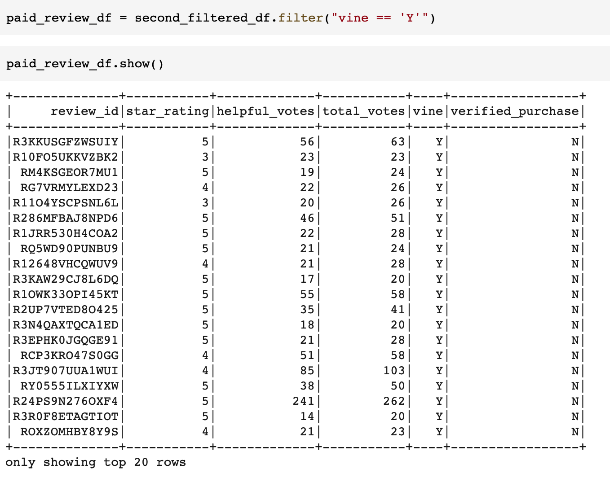

# Amazon Vine Analysis
The objective of this analysis was to investigate if there is any impact to rating scores based on wheter the reviewer was a member of the Vine program (paid participant) or an unpaid, non-incentivized reviewer.  

## Results

### Paid (Vine) Reviews

### Unpaid (Non-Vine) Reviews

### Analysis

### Vine Reviews vs. Non-Vine Reviews and 5-star Rating Impact
* There were a total of 94 Vine (paid) reviews and a total of 40,471 non-Vine (unpaid) reviews.
* 48 Vine reviews gave a five star rating, while 15,663 non-Vine reviews gave five star ratings.
* The resulting percentages of five star ratings across each group was 51% for Vine reviews and 39% for non-Vine reviews.

## Summary
There definitely appears to be a potential bias that is being incorporated into the Vine (paid) reviews, likely influenced by the fact that they're receiving products for free.  A gap of over 10 percentage points seems significantly different between the two cohorts.  A statistical analysis could be performed across each group, to better understand the distribution differences between scores.  It is likely that the paid group is skewing more positive than the unpaid group, but additional tests could be run to confirm that.  
